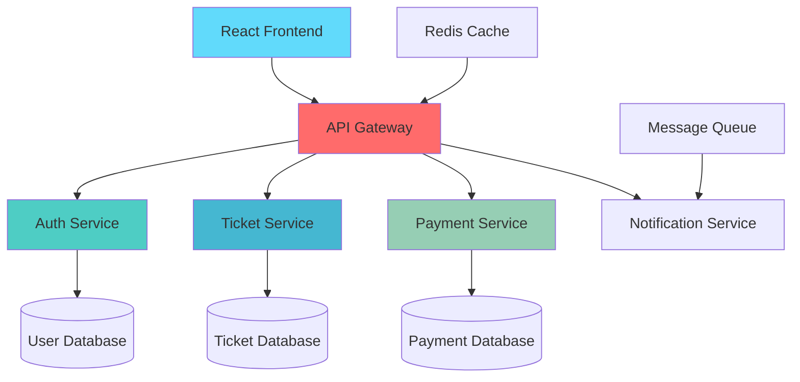

# 💫 FAIZ OUSSAMA
<p align="right">
  
</p>

<div align="center">
  
  
  
  [](https://git.io/typing-svg)
  
  [](https://github.com/faiz-oussama)
  
</div>

---

## 🚀 About Me

<table>
<tr>
<td width="50%">

### 👨‍💻 The Developer

```typescript
interface Developer {
  name: string;
  location: string;
  currentRole: string;
  languages: string[];
  architecture: string[];
  currentFocus: string;
  lifePhilosophy: string;
}

const faizOussama: Developer = {
  name: "Faiz Oussama",
  location: "Morocco 🇲🇦",
  currentRole: "Full-Stack Software Engineer",
  languages: ["JavaScript", "TypeScript", "Java", "Python"],
  architecture: ["Microservices", "Event-Driven", "Clean Architecture"],
  currentFocus: "Building scalable ticketing platforms",
  lifePhilosophy: "Code with purpose, build with passion"
};
```

</td>
<td width="50%">

### 🎯 What Drives Me

🔥 **Passion:** Creating software that solves real-world problems  
🌱 **Learning:** Always staying ahead of the technology curve  
🤝 **Community:** Contributing to open-source and mentoring developers  
💡 **Innovation:** Turning complex ideas into elegant solutions  
🎨 **Craft:** Writing clean, maintainable, and scalable code  

### 📫 Quick Connect
[](https://linkedin.com/in/oussama-faiz)
[](mailto:faizouss123@gmail.com)
[](https://twitter.com/faiz_oussama)

</td>
</tr>
</table>

---

## 🛠️ Tech Arsenal

<div align="center">

### Frontend Mastery


### Backend Excellence


### Database & Cloud


### DevOps & Tools


</div>

---

## 🎯 Current Focus: Full-Stack Ticketing Platform

<div align="center">

### 🏗️ Architecture Overview



### 🔧 Tech Stack
<table align="center">
<tr>
<td align="center"><strong>Frontend</strong></td>
<td align="center"><strong>Backend</strong></td>
<td align="center"><strong>Database</strong></td>
<td align="center"><strong>DevOps</strong></td>
</tr>
<tr>
<td>React + Redux<br/>TypeScript<br/>Tailwind CSS<br/>Material-UI</td>
<td>Spring Boot<br/>Spring Security<br/>Spring JPA<br/>RESTful APIs</td>
<td>MySQL<br/>Redis Cache<br/>JWT Auth<br/>Connection Pooling</td>
<td>Docker<br/>Kubernetes<br/>CI/CD Pipeline<br/>AWS Deployment</td>
</tr>
</table>

</div>

---

## 🌟 Featured Projects

<div align="center">

<table>
<tr>
<td width="50%">

### 🎫 Advanced Ticketing Platform
**Enterprise-grade event management system**


**Key Features:**
- 🔐 JWT Authentication & Authorization
- 💳 Secure Payment Processing
- 📊 Real-time Analytics Dashboard
- 🎨 Responsive Material-UI Design
- 🚀 Microservices Architecture

[](https://github.com/faiz-oussama)

</td>
<td width="50%">

### 📝 Collaborative Text Annotation Platform
**AI-powered text analysis with quality control**


**Key Features:**
- 🤖 ML-powered Text Analysis
- 👥 Multi-user Collaboration
- 📈 Quality Control Metrics
- 🔄 Real-time Synchronization
- 📊 Advanced Reporting

[](https://github.com/faiz-oussama/Collaborative-Text-Annotation-Platform-with-Quality-Control)

</td>
</tr>
</table>

</div>

---

## 📊 GitHub Analytics

<div align="center">


### 🏆 GitHub Achievements


### 📈 Contribution Graph


</div>

---

## 🌐 Let's Connect & Collaborate

<div align="center">

### 💬 I'm always excited to discuss:
🚀 **Innovative Software Solutions** • 🏗️ **System Architecture** • 🤝 **Open Source Contributions** • 📚 **Tech Mentorship**

<table>
<tr>
<td align="center">
<a href="mailto:faizouss123@gmail.com">

</a>
</td>
<td align="center">
<a href="https://linkedin.com/in/oussama-faiz">

</a>
</td>
<td align="center">
<a href="https://twitter.com/faiz_oussama">

</a>
</td>
<td align="center">
<a href="https://dev.to/faizoussama">

</a>
</td>
</tr>
</table>

### 💭 Developer Philosophy

> *"The best code is not just functional—it's elegant, maintainable, and tells a story. Every line should serve a purpose, every function should have meaning, and every project should make someone's life better."*

---

**⚡ Fun Facts:**
- 🌙 I code best during late-night sessions with ambient music
- ☕ Coffee consumption directly correlates with code quality
- 🎮 Gaming taught me problem-solving before programming did
- 🌍 I believe technology should bridge cultures, not divide them

</div>

<div align="center">
  
  
  
  **Made with ❤️ and lots of ☕**
  
  
  
</div>

---

<div align="center">
  <sub>🔥 <strong>Open to freelance opportunities and exciting collaborations!</strong> 🔥</sub>
</div>
